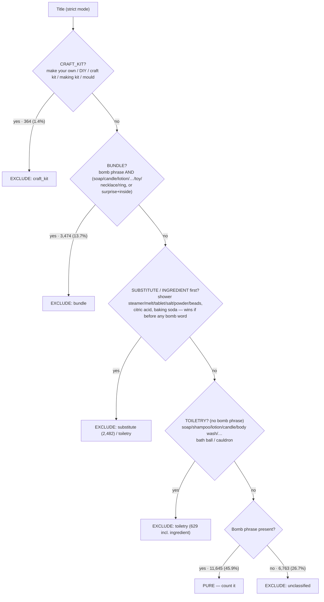
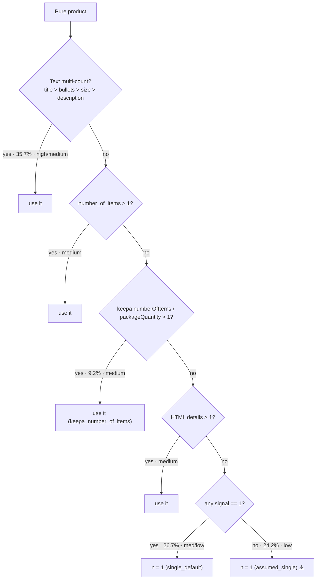

# Count Bath Bombs

For each Amazon listing, decide whether it is a **pure finished bath-bomb
product** and, if so, count how many **single bomb units** it contains
(`n_bomb_balls`). Rules-only (title/text + catalog + HTML + Keepa), with a human
review/label loop for building and checking gold.

## Pipelines at a glance

Two pipelines: one **produces counts**, one lets humans **review & check** them.

### 1. Counting pipeline — `scripts/run_pipeline.py` → `count_bath_bombs/pipeline.py`

Runs over all ~25k listings in stages, each adding columns to the frame:

| Stage | Module | What it does |
|-------|--------|--------------|
| Load | `pipeline.load_products` | Read the input CSV, keep the relevant columns |
| HTML extract | `html_extract.py` | Parse the scraped Amazon HTML per ASIN (title, bullets, description, "Number of Items"/"Unit Count"/"Package Quantity", size, weight). Cached per ASIN. Skippable with `--skip-html` |
| Keepa (2nd source) | `keepa.py` | Join the Keepa product export on `asin` → `keepa_*` fields (numberOfItems, packageQuantity, features, description, images, variations). Used as a **fallback / second signal** for counts and purity. Toggle with `keepa.enabled`; degrades to null columns if the source is unavailable |
| Purity | `purity.py` | Regex rules on the **title** (strict mode) → `is_pure_bath_bomb` ∈ {True, False} + `exclude_reason`. A six-detector ladder (craft_kit / bundle / substitute / toiletry / unclassified). Scope config toggles shower bombs / steamers / melts / fizz tablets |
| Candidates | `counts.py` | Extract every possible count from title/size/bullets/description + catalog fields ("Set of 6", "12 bombs", "3 x 5oz"), each tagged with the pattern that matched |
| Resolve | `resolve.py` | For **pure** items only, pick the final `n_bomb_balls` via a priority ladder (text multi-count → number_of_items → Keepa numberOfItems → HTML details → single default), set `count_confidence` / `count_source`. Excluded items get no count |

Outputs `output/product_counts.csv` (and an optional stratified
`labeling_sample.csv`).

### 2. Review pipeline — `label_ui.py` · `eval_gold.py`

Review in the Streamlit console → labels land in `annotations.csv` → adjudicated
(majority vote per ASIN) into `gold_labels.csv` → `eval_gold.py` compares the rule
predictions against that human gold. No train/eval split, no model seeding — just
rules vs. human labels.

## Counting SOP (annotated with live volumes)

The decision procedure, with each rule's share of the current **25,357-listing**
run. Purity branches are % of all listings; count branches are % of the **11,645
pure** products. First matching rule wins at every stage.

### Stage 1 — Purity: is this a countable bath bomb? (`purity.py`)

Judged from the **title** in strict mode. A mutually-exclusive detector ladder;
first match wins. Every listing ends up either **pure** or **excluded** (with a
reason) — there is no null/undecided state.



| `exclude_reason` | `purity_source` | Fired | Share |
|---|---|---|---|
| — (PURE) | `rule_positive` | 11,645 | 45.9% |
| `unclassified` | `rule_unclassified` | 6,763 | 26.7% |
| `bundle` | `rule_bundle` | 3,474 | 13.7% |
| `substitute` | `rule_substitute` | 2,482 | 9.8% |
| `toiletry` | `rule_toiletry` + `rule_ingredient` | 629 | 2.5% |
| `craft_kit` | `rule_craft_kit` | 364 | 1.4% |

**Gating modes:**
- **CRAFT_KIT** excludes only genuine DIY markers — "Bath Bomb **Kit**" (a finished gift set) stays PURE.
- **BUNDLE** requires a bomb phrase **and** a non-bomb companion (`soap` [guarded against "Soap Co"/"soap-free"], candle, lotion, shampoo, body wash, …) or hidden item (necklace/ring/toy, or surprise+inside) — a bath bomb sold *with* something else.
- **SUBSTITUTE** (shower steamer/melt/tablet/disc/fizz, bath salt/powder/beads/melt, fizz tablet, bubble bath) and **INGREDIENT** (citric acid, baking soda → reported as `toiletry`) use **first-word adjudication**: they exclude only if the term appears *before* any bomb phrase ("Bath Bomb & Shower Steamer" → PURE; "Shower Steamer, Bath Bomb Sampler" → substitute). Substitute sub-families are gated by `scope.include_*`.
- **TOILETRY** excludes only when there is no bomb phrase. `bath ball` / `cauldron` are toiletry-only words: a lone "Bath Ball" is toiletry, but "Magic Bath Balls … Bath Bombs" / "Cauldron Bath Bomb" stay PURE.
- **UNCLASSIFIED** — no bomb phrase and no other signal; excluded, flagged for review.

### Stage 2 — Detect candidate numbers (`counts.py`)

Five regexes scan four **text channels** separately; each keeps **one** number —
lowest-priority pattern, preferring values >1:

| Channel | Fields concatenated |
|---|---|
| title | `title` |
| size | `size` |
| bullets | `html_bullets` + `feature` + `keepa_features` |
| description | `product_description` + `html_description` + `keepa_description` |

| Priority | Pattern | Example |
|---|---|---|
| 0 | `set_of` | "Set of 6" |
| 1 | `n_x_bombs` | "6 x 5oz bombs" |
| 2 | `near_bomb/ball/fizz/blaster` | "12 bath bombs" |
| 3 | `pack_of` | "Pack of 8" |
| 4 | `near_pack` | "4 pack" |
| 5 | `near_pcs/pieces/count` | "24 pcs" |

Catalog integers are read as-is (>0): `number_of_items`, Keepa `numberOfItems` /
`packageQuantity`, HTML "Number of Items"/"Unit Count"/"Package Quantity", plus
`unit_num` (when `unit_text`∈{count,each,unit}) and `label_unit_num` (when
`label_unit` mentions "count").

> ⚠️ The high-volume patterns (`near_pack`, `near_pcs`, `near_count`) are the
> **weakest/most generic** — they match any number next to "pack/pcs/count",
> which is where scent-count and size false positives creep in.

### Stage 3 — Choose the number (`resolve.py`)

**Only pure products are counted.** A precedence ladder; first tier with a value
>1 wins. Shares are of the **11,645 pure** products.



Flags set alongside the number:
- **`seller_counts_pack_as_one`** — text says a multi-count but a catalog field says 1. Recorded only; **does not change the count**.
- **`count_unable`** — no number could be justified. Currently always `False` (the `assumed_single` fallback always yields 1), kept for schema stability.

**Where the volume goes** (of 11,645 pure): explicit **text count 35.7%** (title
29.3% · bullets/desc/size 6.4%), **catalog 13.5%** (keepa 9.2% · number_of_items
2.2% · html 2.0%), **single_default 26.7%**, **assumed_single 24.2%**.
Confidence: low 44.1% · high 32.5% · medium 23.3%.

## Setup

```bash
python3 -m venv .venv
.venv/bin/pip install -r requirements.txt
```

## Recommended workflow

```bash
# 1) Rules + HTML + Keepa. Counts every pure bath bomb.
.venv/bin/python scripts/run_pipeline.py --labeling-sample

# Smoke without HTML:
.venv/bin/python scripts/run_pipeline.py --skip-html --labeling-sample

# 2) Review + label in the browser (thumbnail, evidence, scraped page render)
.venv/bin/streamlit run scripts/label_ui.py

# 3) Compare the rules against the human gold
.venv/bin/python scripts/eval_gold.py --rebuild            # rebuild gold from annotations, then score
.venv/bin/python scripts/eval_gold.py --report             # full report: confusion, F1, by-confidence/stratum, errors
.venv/bin/python scripts/eval_gold.py --report --out output/gold_metrics.json
```

## Labeling / gold model

- `data/gold/annotations.csv` — every raw label, one row per (ASIN, annotator).
- `data/gold/gold_labels.csv` — **derived**, one adjudicated row per ASIN
  (majority vote, ties → most recent). Rebuilt automatically on each save and by
  `eval_gold.py --rebuild`.
- The Streamlit **Review** tab shows the rule prediction + evidence and lets you
  confirm/correct it (`is_pure_bath_bomb`, `n_bomb_balls`, `exclude_reason`). Two
  independent sidebar filters: **Classification** (pure / craft_kit / bundle /
  substitute / toiletry / unclassified) and **Counting** (multi_pack / single /
  pack_as_one / extreme_count).
- The **Dashboard** tab shows progress, inter-annotator agreement (purity/count
  agreement + Cohen's κ) and a plain human-gold-vs-rule comparison.

## Results (current run)

Counting pipeline over **25,357 listings** (rules + HTML + Keepa):

| Metric | Value |
|--------|-------|
| Pure bath bombs (counted) | **11,645** (45.9%) |
| Excluded | 13,712 — unclassified 6,763 · bundle 3,474 · substitute 2,482 · toiletry 629 · craft_kit 364 |
| Count confidence (of pure) | low 5,140 · high 3,788 · medium 2,717 |

> Purity is deliberately strict: shower steamers/salts/tablets/melts
> (`substitute`), bath-bomb-plus-item sets (`bundle`), raw ingredients like citric
> acid (`toiletry`), and titles with no bomb phrase (`unclassified`) are all
> excluded. Grow the gold set via the Review console, then `eval_gold.py --report`
> to measure accuracy — the small existing gold predates the current rules.

## Config knobs

| Key | Default | Meaning |
|-----|---------|---------|
| `purity.strict` | `true` | Title-primary detection (fewer false excludes from feature text) |
| `scope.include_shower_bombs` | `true` | Count shower bombs |
| `scope.include_shower_steamers` | `false` | Exclude shower steamers/melts/tablets (→ substitute) |
| `scope.include_bath_melts` / `include_fizz_tablets` | `false` | Out of scope (→ substitute) |
| `keepa.enabled` | `true` | Join the Keepa export (`paths.keepa_csv`) as a second source. Off → null `keepa_*` columns |

### Two-source comparison (Keepa vs amazon_web_scraping)

Both sources cover the same **25,357 ASINs (perfect 1:1 join)** and are
complementary, so Keepa is wired as a fallback rather than a replacement:

| Field | amazon_web_scraping | Keepa | Wiring |
|---|---|---|---|
| `number_of_items` | 2,493 present | **12,714 present** (99.8% agree where both) | Keepa fills the count ladder (`keepa_number_of_items` counts ~9% of pure) |
| images | `image_num` count only | **imagesCSV URLs, all rows** (97% non-empty) | `keepa_main_image_url` / `keepa_image_count`; UI thumbnail fallback |
| variations | 2,627 | **all rows** (`variationCSV`) | `keepa_variation_count` |
| features | 62% non-empty | **75% non-empty** | added to bullets text for count regexes |
| description | **93% non-empty** | 51% | scrape stays primary; Keepa fallback |
| title | — | 59% exact match (different snapshot) | Keepa title only as last-resort fallback |

## Outputs

| Path | Role |
|------|------|
| `output/product_counts.csv` | Predictions (`is_pure_bath_bomb`, `exclude_reason`, `n_bomb_balls`, `count_confidence`, `count_source`, `keepa_*`, …) |
| `output/labeling_sample.csv` | Stratified review sheet (`class_label` / `count_label` per row) |
| `data/gold/annotations.csv` | Raw multi-annotator labels |
| `data/gold/gold_labels.csv` | Adjudicated gold, derived from annotations |
