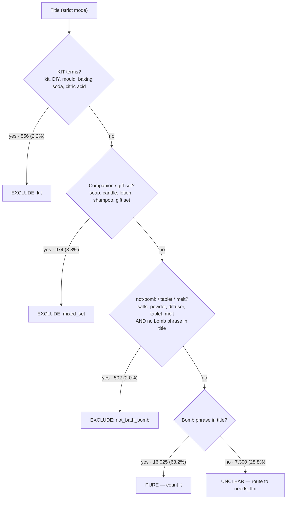
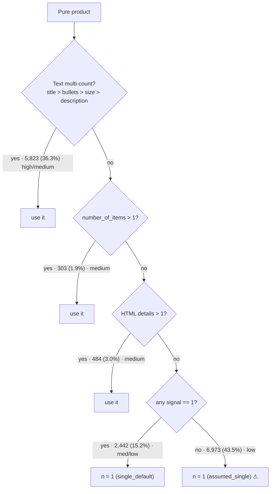

# Count Bath Bombs

Onboarding task: for each Amazon listing, decide whether it is a **pure finished
bath-bomb product** and, if so, count how many **single bomb units** it contains
(`n_bomb_balls`). Rules-first, with an optional LLM fallback and a human
review/label loop for building and scoring gold.

## Pipelines at a glance

There are two pipelines: one that **produces counts**, one that **labels &
evaluates** them.

### 1. Counting pipeline — `scripts/run_pipeline.py` → `count_bath_bombs/pipeline.py`

Runs over all ~25k listings in stages, each adding columns to the frame:

| Stage | Module | What it does |
|-------|--------|--------------|
| Load | `pipeline.load_products` | Read the input CSV, keep the relevant columns |
| HTML extract | `html_extract.py` | Parse the scraped Amazon HTML per ASIN (title, bullets, description, "Number of Items"/"Unit Count"/"Package Quantity", size, weight). Cached per ASIN. Skippable with `--skip-html` |
| Purity | `purity.py` | Regex rules on the **title** (strict mode) → `is_pure_bath_bomb` ∈ {True, False, None}. Excludes kits/DIY/molds, mixed gift sets, non-bombs (salts/tablets/melts). Scope config toggles shower bombs / melts / fizz tablets |
| Candidates | `counts.py` | Extract every possible count from title/size/bullets/description + catalog fields ("Set of 6", "12 bombs", "3 x 5oz"), each tagged with the pattern that matched |
| Resolve | `resolve.py` | Pick the final `n_bomb_balls` via a priority ladder (text multi-count → number_of_items → HTML details → single default), set `count_confidence`/`count_source`, flag `needs_llm` on conflicts/undecided |
| LLM (opt-in) | `llm.py` | With `--enable-llm`, send only `needs_llm` rows to the model (cached, logged); overrides purity/count only when it returns a value |

Outputs `output/product_counts.csv` (+ `needs_llm.csv`, `hard_cases.csv`, and an
optional stratified `labeling_sample.csv`).

### 2. Labeling & evaluation pipeline — `label_ui.py` · `seed_labels.py` · `eval_gold.py`

Turns human review into a scored gold set (see **Labeling / gold model** below):
review in the Streamlit console → labels land in `annotations.csv` → adjudicated
into `gold_labels.csv` → `eval_gold.py` scores predictions against the held-out
eval split.

## Counting SOP (annotated with live volumes)

The decision procedure, with each rule's share of the current **25,357-listing**
run. Purity branches are % of all listings; count branches are % of the **16,025
pure** products. First matching rule wins at every stage.

### Stage 1 — Purity: is this a countable bath bomb? (`purity.py`)

Judged from the **title** in strict mode. Kit and mixed-set exclude regardless of
wording; a bomb phrase ("bath bomb/fizzy/ball/blaster", "shower bomb") **rescues**
a title from the not-bomb/tablet/melt checks.



| Rule (`purity_source`) | Fired | Share |
|---|---|---|
| `rule_positive` → PURE | 16,025 | 63.2% |
| `rule_unclear` → UNCLEAR | 7,300 | 28.8% |
| `rule_kit` | 556 | 2.2% |
| `rule_mixed` + `_gift_bullets` + `_weak` | 974 | 3.8% |
| `rule_not_bomb` + `rule_tablet` + `rule_melt` | 502 | 2.0% |
| `rule_shower` (disabled — shower bombs count) | 0 | — |

### Stage 2 — Detect candidate numbers (`counts.py`)

Five regexes scan four text fields (title, size, bullets, description) separately;
each field keeps **one** number — lowest-priority pattern, preferring values >1.
Catalog integers (`number_of_items`, HTML unit/package counts) are read as-is.

| Priority | Pattern | Example | Times fired |
|---|---|---|---|
| 0 | `set_of` | "Set of 6" | 1,293 |
| 1 | `n_x_bombs` | "6 x 5oz bombs" | 212 |
| 2 | `near_bomb/ball/fizz` | "12 bath bombs" | ~370 |
| 3 | `pack_of` | "Pack of 8" | 1,174 |
| 4 | `near_pack` | "4 pack" | 3,333 |
| 5 | `near_pcs/pieces/count` | "24 pcs" | 4,058 |

> ⚠️ The high-volume patterns (`near_pack`, `near_pcs`, `near_count`) are the
> **weakest/most generic** — they match any number next to "pack/pcs/count",
> which is where scent-count and size false positives creep in.

### Stage 3 — Choose the number (`resolve.py`)

A precedence ladder; first tier with a value >1 wins. Shares are of the 16,025 pure.



Flags set alongside the number:
- **`seller_counts_pack_as_one`** (631 rows) — text says a multi-count but a catalog
  field says 1. Recorded only; **does not change the count**.
- **conflict** — text multi-count ≠ catalog multi-count → forces `needs_llm=True`.

**Where the volume actually goes** (pure products): `assumed_single` **43.5%** is
the single largest source — i.e. nearly half of all counts are the "no evidence →
assume 1" fallback, the rule the eval flagged as the main error driver. Only
**36.3%** come from an explicit text count; **15.2%** are `single_default`.
Overall confidence: low 61.8% · high 21.5% · medium 8.6% · n/a 8.0%.

## Setup

```bash
python3 -m venv .venv
.venv/bin/pip install -r requirements.txt
cp .env.example .env   # then paste OPENAI_API_KEY into .env (only needed for --enable-llm)
```

## Recommended workflow

```bash
# 1) Rules + HTML parse (LLM off by default). Assigns a count unless unable.
.venv/bin/python scripts/run_pipeline.py --labeling-sample

# Smoke without HTML:
.venv/bin/python scripts/run_pipeline.py --skip-html --labeling-sample

# 2) Review + label in the browser (thumbnail, evidence, scraped page render)
.venv/bin/streamlit run scripts/label_ui.py

# 2b) (optional) Seed confident TRAIN-split rows to pre-fill the UI for fast confirm
.venv/bin/python scripts/seed_labels.py --dry-run   # preview count
.venv/bin/python scripts/seed_labels.py             # write model_seed annotations

# 3) Later: improve unsure/undecided rows only (needs_llm=True)
.venv/bin/python scripts/run_pipeline.py --enable-llm

# 4) Score vs gold — defaults to the held-out EVAL split (honest)
.venv/bin/python scripts/eval_gold.py --rebuild             # rebuild gold from annotations, score eval
.venv/bin/python scripts/eval_gold.py --split all --report  # full report: confusion, F1, by-confidence/stratum, errors
.venv/bin/python scripts/eval_gold.py --split all --report --out output/gold_metrics.json
```

## Labeling / gold model

Labels flow through a multi-annotator store so agreement can be measured and the
model is never scored on labels it produced itself:

- `data/gold/annotations.csv` — every raw label, one row per (ASIN, annotator),
  tagged `source` (`human` / `model_seed`) and `split` (`eval` / `train`).
- `data/gold/gold_labels.csv` — **derived**, one adjudicated row per ASIN
  (human-only majority vote, ties → most recent). Consumed by `eval_gold.py`.
- **Held-out eval split** (`gold.eval_frac`, deterministic per ASIN) is **never
  seeded** from predictions — so `eval_gold.py --split eval` is an honest score.
- The Streamlit **Dashboard** tab shows inter-annotator agreement (purity/count
  agreement + Cohen's κ), conflicts to adjudicate, and human-vs-model by split.
  Use the sidebar *"Only eval rows needing a 2nd label"* filter to build agreement.

## Results (current run)

Counting pipeline over **25,357 listings** (rules + HTML, LLM off):

| Metric | Value |
|--------|-------|
| Pure bath bombs (count assigned) | **16,025** (63%) |
| Excluded | 2,032 — mixed_set 974 · kit 556 · not_bath_bomb 502 |
| Unclear (purity undecided) | 7,300 |
| Queued for LLM (`needs_llm`) | 7,737 |
| Confidence: high / medium / low | 5,457 · 2,190 · 15,678 |

Model evaluation vs **50 human labels** (`eval_gold.py --report`):

| Split | Purity P / R / F1 | Count exact / ±1 | Count MAE |
|-------|-------------------|------------------|-----------|
| `eval` (honest, held-out) | 1.00 / 1.00 / 1.00 | 1.00 / 1.00 | 0.0 |
| `all` (incl. train) | 0.90 / 0.78 / 0.84 | 0.78 / 0.78 | 2.06 |

Purity confusion (all): TP 18 · FP 2 · **FN 5** · TN 12. Calibration is sane —
`high`-confidence rows score 100% purity accuracy, `low` ≈ 78%.

Key findings driving the next iteration:
- **Recall < precision (0.78 vs 0.90): the rules over-exclude.** 5 pure products
  were wrongly marked not-pure — the LLM pass targets exactly these.
- **Count errors are single-vs-multipack:** every count miss is `pred=1` vs a real
  6–16, i.e. the `assumed_single` default undercounts packs with no count wording.
- **`needs_llm` stratum purity ≈ 60%** — confirms those rows genuinely need the LLM.

> Gold is still small (50 labels; 6 held out), so treat the `eval` row as
> directional — the priority is to grow and double-label the eval slice.
> Full breakdown lives in `output/gold_metrics.json`.

## Config knobs

| Key | Default | Meaning |
|-----|---------|---------|
| `purity.strict` | `true` | Title-primary exclude/include (fewer false kit excludes from feature text) |
| `scope.include_shower_bombs` | `true` | Count shower bombs |
| `scope.include_bath_melts` / `include_fizz_tablets` | `false` | Out of scope |
| `llm.enabled` | `false` | Stay off until you pass `--enable-llm` |

## Outputs

| Path | Role |
|------|------|
| `output/product_counts.csv` | Predictions (`n_bomb_balls`, `needs_llm`, …) |
| `output/needs_llm.csv` | Unsure / undecided rows for a later LLM pass |
| `output/labeling_sample.csv` | Stratified sheet feeding the labeler |
| `data/gold/annotations.csv` | Raw multi-annotator labels (human + model_seed, with split) |
| `data/gold/gold_labels.csv` | Adjudicated human-only gold, derived from annotations |
| `prompts/count_v1.md` | Frozen LLM prompt |
| `.env` | `OPENAI_API_KEY=...` (gitignored) |
